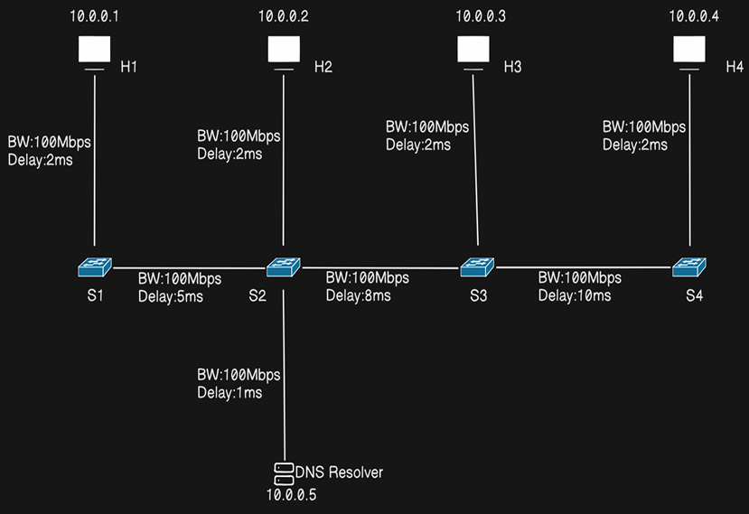

# CS331: Computer Networks Assignment 2

**Submission Date:** Before 26-10-2025, 11:59 PM

## Assignment Guidelines

- The assignment must be completed in pairs (two students per team). Mention the team details at the beginning of your submission document. Only one member of each team should submit the assignment on behalf of both.
- Submit a comprehensive report (PDF, max 10 pages) and a GitHub link to the project (public repository).
- The report must be fully self-contained; evaluation will be based solely on its contents.
- Late submissions will not be evaluated.

## Task: DNS Query Resolution (100 Points)

### A. (20 Points)
Simulate the below given topology in Mininet and demonstrate successful connectivity among all nodes.

### B. (10 Points)
In the simulated topology, use the default host resolver to resolve the URLs specified in each host's respective PCAP file [[Link]](https://drive.google.com/drive/u/0/folders/1fjpB9swfPue08OMaBF5VhK5KonYg4TUL), and record for each host the average lookup latency, average throughput, number of successfully resolved queries, and number of failed resolutions.

### C. (10 Points)
Modify the DNS configuration of all Mininet hosts to use your custom resolver as the primary DNS server instead of the default system resolver. Show all the steps along with relevant screenshots.

### D. (60 Points)
Repeat DNS resolution for the given PCAPs as done in part B, this time using your custom DNS resolver (10.0.0.5). Compare the results with those obtained in part B. Additionally, log the following in the custom DNS resolver:

1. Timestamp
2. Domain name queried
3. Resolution mode
4. DNS server IP contacted
5. Step of resolution (Root / TLD / Authoritative / Cache (if caching implemented))
6. Response or referral received
7. Round-trip time to that server
8. Total time to resolution
9. Cache status (HIT / MISS) (if caching implemented)

For PCAP_1_H1, present graphical plots for the first 10 URLs, showing the total number of DNS servers visited and latency per query.

## Bonus:

### E. (2.5 Points)
Implement recursive resolution mode in the custom DNS resolver. Modify the provided PCAP files to set a recursive_mode flag to True for all queries. If the resolver supports recursion, it should resolve recursively; otherwise, it should fall back to default resolution mode. Record the average lookup latency, average throughput, number of successfully resolved queries, % of queries resolved from cache and number of failed resolutions.

### F. (2.5 Points)
Implement caching within your custom DNS resolver. Store recently resolved domain-to-IP mappings and serve repeated queries directly from cache without contacting external servers. Record the average lookup latency, average throughput, number of successfully resolved queries, % of queries resolved from cache and number of failed resolutions.